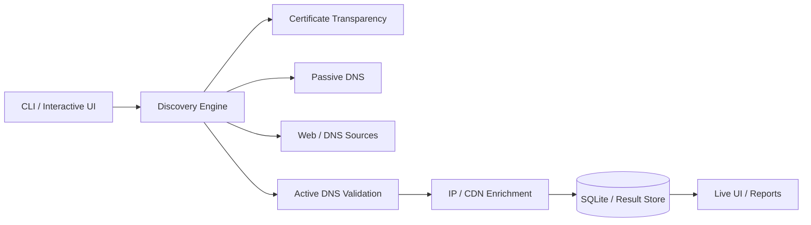
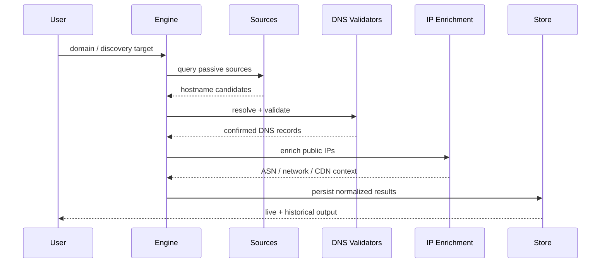

# Round-Robin

<p align="center">
  <strong>Cross-platform DNS discovery, correlation and validation toolkit</strong><br/>
  Passive + active discovery • DNS validation • IP enrichment • SQLite persistence • interactive CLI
</p>

<p align="center">
  
  
  
  
  
</p>
<p align="center">
  <a href="https://github.com/Danial-Zolfaghari/Round-Robin/actions/workflows/ci.yml"></a>
  <a href="https://github.com/Danial-Zolfaghari/Round-Robin/releases"></a>
  <a href="LICENSE"></a>
</p>


---

## Overview

**Round-Robin** is a Python DNS-discovery pipeline built to collect candidate hostnames from multiple sources, validate them, resolve network information, enrich public IPs and persist results for later review.

The public build contains **no organization-specific DNS ranges or private infrastructure targets**. Resolver addresses and service integrations are configurable.

## Platform support

| Platform | Support | Notes |
|---|---|---|
| Linux | ✅ Full | Recommended for server/automation use |
| Windows 10/11 | ✅ Full | PowerShell / CMD supported |
| macOS | ✅ Full | Python 3.10+ required |

## Architecture



## Pipeline



## Features

- Certificate Transparency discovery via crt.sh
- Passive host discovery sources
- Direct DNS lookups and parser utilities
- Active hostname validation
- Configurable DNS resolver pool
- Retry / failure tracking
- Rate limiting
- Public-IP enrichment
- CDN classification helpers
- SQLite-backed persistence
- Interactive Rich-based terminal UI
- Environment-based optional API configuration
- Cross-platform Python implementation

## Requirements

- Python **3.10+**
- Internet access for public discovery/enrichment sources

Python packages:

```text
colorama>=0.4.6
rich>=13.0.0
dnspython>=2.4.0
httpx>=0.27.0
python-dotenv>=1.0.0
```

## Installation

```bash
git clone https://github.com/Danial-Zolfaghari/Round-Robin.git
cd Round-Robin
python -m venv .venv
```

Linux / macOS:

```bash
source .venv/bin/activate
pip install -r requirements.txt
```

Windows PowerShell:

```powershell
.\.venv\Scripts\Activate.ps1
pip install -r requirements.txt
```

## Configuration

Copy the example environment file:

```bash
cp .env.example .env
```

Windows:

```powershell
Copy-Item .env.example .env
```

Optional provider/API values belong in `.env`; never commit real API keys.

The built-in resolver pool uses well-known public DNS resolvers and can be changed in configuration.

## Run

Module entry point:

```bash
python -m dns_discovery --help
```

Compatibility launcher:

```bash
python "Round Robin Hunter.py"
```

Windows convenience launcher:

```bat
start.bat
```

## Project structure

```text
Round-Robin/
├─ dns_discovery/
│  ├─ dns/
│  ├─ enrich/
│  ├─ sources/
│  ├─ validate/
│  ├─ cli.py
│  ├─ config.py
│  ├─ engine.py
│  ├─ hunter.py
│  ├─ live_ui.py
│  ├─ models.py
│  └─ store.py
├─ Round Robin Hunter.py
├─ .env.example
├─ requirements.txt
└─ start.bat
```

## Security / privacy

Discovery results may reveal hostnames and network metadata. Do not commit result databases, environment files or exports containing private infrastructure.

Use the tool only for domains and infrastructure you own or are authorized to assess.

## Author

**Danial Zolfaghari** — [@Danial-Zolfaghari](https://github.com/Danial-Zolfaghari)
