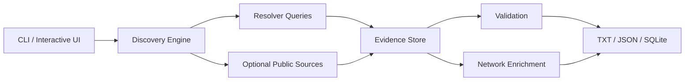

# Round Robin Hunter

<p align="center">
  <strong>Cross-platform DNS observation, resolver comparison and evidence collection toolkit</strong>
</p>

<p align="center">
  
  
  
  
</p>

## Overview

Round Robin Hunter is a Python toolkit for observing how hostnames resolve across multiple DNS resolvers and for keeping evidence-backed records of the IP addresses seen over time. It combines live DNS checks, optional historical sources, certificate-transparency observations, validation, enrichment and a Rich terminal interface.

## Supported platforms

| Platform | Support | Notes |
|---|---:|---|
| Windows 10/11 | ✅ | Python 3.11+; `start.bat` included |
| Linux | ✅ | Python 3.11+; run with `python3` |
| macOS | ✅ | Python 3.11+ |

## Architecture



## Highlights

- Multiple DNS resolvers
- Unique IPv4 collection per hostname
- Optional certificate-transparency and historical observations
- Structured failure tracking with secret redaction
- Optional IP/ASN/provider enrichment
- Optional TLS/TCP validation
- TXT, JSON and SQLite evidence outputs
- Rate limiting and bounded concurrency
- Rich interactive terminal workflow
- Optional provider credentials loaded from environment variables

## Requirements

- Python 3.11+
- Internet connectivity for public resolver/source queries

Install:

```bash
python -m pip install -r requirements.txt
```

Core packages:

| Package | Purpose |
|---|---|
| `dnspython` | DNS queries |
| `httpx` | HTTP source/enrichment requests |
| `rich` | Terminal UI |
| `colorama` | Terminal compatibility |
| `python-dotenv` | Optional local environment configuration |

## Configuration

Copy the example environment file:

```bash
cp .env.example .env
```

PowerShell:

```powershell
Copy-Item .env.example .env
```

Optional API-backed integrations read keys from environment variables. Real keys must never be committed.

## Run

Interactive mode:

```bash
python "Round Robin Hunter.py"
```

Module mode:

```bash
python -m dns_discovery
```

Windows shortcut:

```bat
start.bat
```

## Project layout

```text
Round-Robin/
├─ dns_discovery/
│  ├─ dns/
│  ├─ enrich/
│  ├─ sources/
│  ├─ validate/
│  ├─ cli.py
│  ├─ engine.py
│  ├─ hunter.py
│  ├─ live_ui.py
│  ├─ models.py
│  └─ store.py
├─ .env.example
├─ requirements.txt
├─ Round Robin Hunter.py
└─ start.bat
```

## Security and privacy

The public repository does not contain production credentials or environment-specific private-IP exclusions. Optional service keys belong in a local `.env` file, which is ignored by Git.

Use the project only with domains and infrastructure you own or are authorized to inspect.

## Author

**Danial Zolfaghari**  
GitHub: **@Danial-Zolfaghari**
